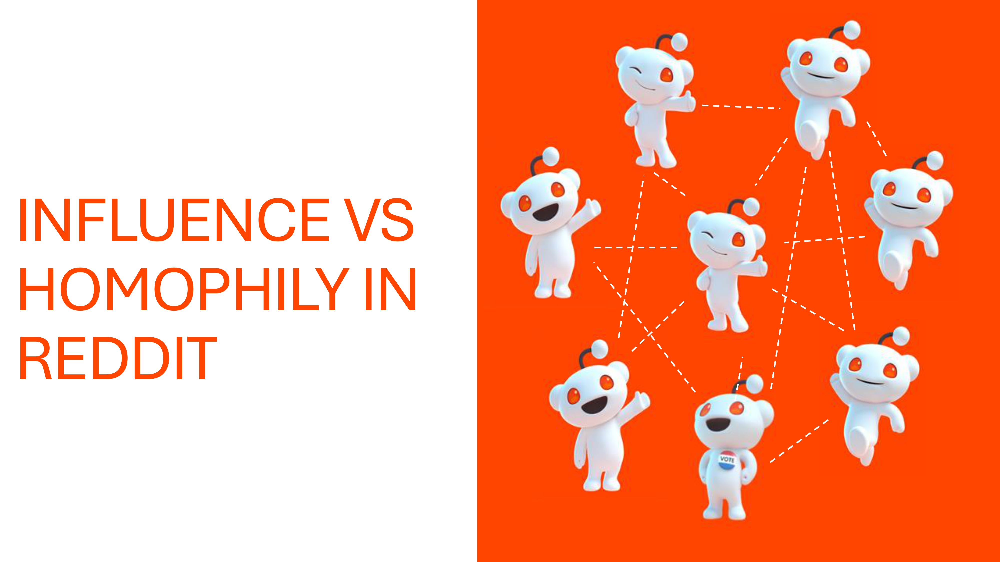

# Reddit Subreddit Dynamics: Homophily vs. Influence




## Table of Contents
1. [Project Overview](#project-overview)
2. [Features](#features)
3. [Data Workflow](#data-workflow)
4. [Results](#results)
5. [Chi-Squared Test Details](#chi-squared-test-details)
6. [Business Implications](#business-implications)
7. [Future Directions](#future-directions)
8. [How to Run the Project](#how-to-run-the-project)
9. [Acknowledgments](#acknowledgments)

---

## Project Overview

This project investigates whether user engagement in the "DOG" subreddit is driven more by **homophily** (shared interests) or **influence** (users impacting others' interests). Understanding these dynamics aids Reddit in optimizing user retention, content strategies, and advertising as it scales as a public company.

---

## Features

- **Data Collection**:
  - Extracted data from "DOG" and related subreddits ("puppies," "Pets," "PuppySmiles").
  - Sample size: 2,094 users with 2,191,371 user pairs.
  
- **Interaction and Interest Analysis**:
  - Ties: Identified through comments between users.
  - Interests: Based on activity in related subreddits.

- **Homophily vs. Influence Testing**:
  - Used Chi-squared tests to analyze relationships between user interactions and interests over two time periods: 2017 (Time t) and 2019 (Time t+1).

---

## Data Workflow

1. **Data Preparation**:
   - Loaded `.zst` files and converted to JSON.
   - Standardized timestamps and cleaned data by removing irrelevant or missing fields.

2. **Interaction and Interest Tables**:
   - Created tie tables based on user comments in the "DOG" subreddit.
   - Created interest tables based on user activity in related subreddits.

3. **Temporal Segmentation**:
   - Separated data into two time periods: 2017 and 2019.

4. **Chi-Squared Analysis**:
   - Performed three Chi-squared tests to evaluate homophily and influence dynamics.

---

## Results

The results demonstrate that **influence** plays a larger role than **homophily** in driving engagement in the "DOG" subreddit. The Chi-squared values and their interpretations are detailed below.

---

## Chi-Squared Test Details

We calculated Chi-squared values using the formula:

$$
\chi^2 = N \cdot \frac{(ad - bc)^2}{(a+b)(c+d)(a+c)(b+d)}
$$

Where:
- \(a, b, c, d\) represent the values in the contingency table.
- \(N\) is the total number of user pairs.

### Test Results:

1. $(C(X_t, G_t))$ (2017 ties vs. 2017 interests):
   - $(\chi^2 = 17.765\)$ (significant at $(\alpha = 0.05\))$.

2. $(C(X_{t+1}, G_t))$ (2019 ties vs. 2017 interests):
   - $(\chi^2 = 224.682\)$ (highly significant at $(\alpha = 0.05\))$.

3. $(C(X_t, G_{t+1})\)$ (2017 ties vs. 2019 interests):
   - $(\chi^2 = 0.203\)$ (not significant).
     
### Interpretation:
- **Influence** is evident as $( C(X_{t+1}, G_t) > C(X_t, G_t) \)$.
- The lack of significance in $( C(X_t, G_{t+1}) \)$ indicates weak evidence for homophily.

---

## Business Implications

### For Homophily-Driven Communities:
- **Content Recommendations**: Personalized algorithms tailored to user interests.
- **Community Events**: Encourage bonding through interest-based initiatives.
- **Niche Advertising**: Target ads to specific community preferences.

### For Influence-Driven Communities:
- **Leverage Influencers**: Highlight trending users and content.
- **Advertising Strategies**: Align ads with influencers' activities.
- **Information Moderation**: Develop tools to monitor and manage misinformation.

---

## Future Directions

1. **Automated Pipeline**:
   - Develop a system to assess subreddit dynamics using NLP and scalable computations.

2. **Expanded Scope**:
   - Apply this framework to other subreddits to generalize findings.

3. **Multimodal Analysis**:
   - Incorporate visual and textual data to gain deeper insights.

---

## How to Run the Project

### Requirements
Install dependencies:
```bash
pip install -r requirements.txt
```
### Steps

1. **Data Preparation**:
   - Download subreddit data ("DOG_comments.zst", "DOG_submissions.zst", "Pets_comments.zst", "Pets_submissions.zst", "puppies_comments.zst", "puppies_submissions.zst", "PuppySmiles_comments.zst", "PuppySmiles_submissions.zst") from [The Eye](https://the-eye.eu/redarcs/).
   - Place subreddit data in the same directory as jupyter notebook file.
   - Decompress and convert `.zst` files to DataFrames.

2. **Run Analysis**:
   - Open the Jupyter Notebook and run the cells step-by-step.
   - Perform preprocessing, create tie and interest tables, and compute Chi-squared tests.
  
## Acknowledgments
   * Data Source: The Eye
   * Authors: Audrey Delisle, Michelle Barabasz, Sean Clarke, Dhevin DeSilva, Seunghyun Park.
